<p>
  <h1>
    
   <var>&micro<sup>2</sup></var>Tokenizer: Differentiable Multi-Scale Multi-Modal Tokenizer for Radiology Report Generation
  </h1>
</p>

[](https://u2tokenizer.github.io/static/pdfs/%CE%BC2_Tokenizer.pdf)
[](https://u2tokenizer.github.io/)
[](https://huggingface.co/datasets/AlpachinoNLP/CT-RATE-Thinking)
<br>
[](https://huggingface.co/AlpachinoNLP/u2Qwen3-1.7B-Instruct)
[](https://huggingface.co/AlpachinoNLP/u2Qwen3-4B-Instruct)
[](https://huggingface.co/AlpachinoNLP/u2Qwen3-4B-Thinking)
---
> 🎉🎉🎉 Our Paper accepted by the 28th conference of The Medical Image Computing and Computer Assisted Intervention Society (MICCAI). See you in Daejeon, Korea from September 23-27, 2025.

<p align="center">
  
</p>


This repository contains the official paper for μ² Tokenizer, a novel approach for automated radiology report generation (RRG) introduced in the paper "μ² Tokenizer: Differentiable Multi-Scale Multi-Modal Tokenizer for Radiology Report Generation".

Our proposed model, μ²LLM, leverages a multi-scale, multi-modal architecture to generate accurate and clinically salient radiology reports from CT scans.

## 👋 Introduction



we introduce μ²LLM, a multi-scale multimodal large language model. At its core is the novel μ² Tokenizer, an intermediate layer that intelligently fuses visual features from CT scans with textual information. The model is further refined using Direct Preference Optimization (DPO), guided by the specialized medical report evaluation metric, GREEN, to ensure the generated reports align with expert standards.



Our experimental results on four large-scale CT datasets show that μ²LLM outperforms existing methods, highlighting its potential for generating high-quality radiology reports even with limited training data.

## 🚀 Quickstart
Here, we can easily use our model based on Hugging Face.

```python
import argparse
import gzip
import inspect
import json
import os
import struct
import sys
import types

from sympy import content
import torch.nn.functional as F
import torch
import nibabel as nib
import numpy as np
from transformers import AutoModelForCausalLM, AutoTokenizer, GenerationConfig
from monai.data.image_reader import NibabelReader
from monai.transforms import (
        LoadImage,
        Compose,
        CropForeground,
        ToTensor,
        SaveImage,
        ScaleIntensityRangePercentiles,
        RandRotate90,
        RandFlip,
        NormalizeIntensity,
        RandScaleIntensity,
        RandShiftIntensity
    )
from monai.transforms.spatial.functional import resize


_DTYPE_MAP = {
    2: np.uint8,
    4: np.int16,
    8: np.int32,
    16: np.float32,
    64: np.float64,
    256: np.int8,
    512: np.uint16,
    768: np.uint32,
    1024: np.int64,
}
class u2Transform:
    def __init__(self, mode='bilinear', device="cpu"):
        transforms = Compose(
                [
                #LoadImage(image_only=True, ensure_channel_first=False, reader=NibabelReader()),
                ScaleIntensityRangePercentiles(lower=0.5, upper=99.5, b_max=1.0, b_min=0.0, clip=True),
                CropForeground(source_key="image"),
                #NormalizeIntensity(),   
                ToTensor(),
                ]
            )
        self.adaptive_transforms = transforms
        self.mode = mode
        self.save = SaveImage(separate_folder=False, output_postfix='')
        self.device = device

    def adaptive_resize(self, input_path, target_image_size=256, padding_size=32*8):
        """
        adaptive resize the NIfTI file to the target size.
        The minimum dimension is scaled to the target dimension, and other dimensions are scaled proportionally
        """
        data = nib.load(input_path).get_fdata().transpose(2, 0, 1)[np.newaxis, ...]
        data = torch.tensor(data, device=self.device)
        data = self.adaptive_transforms(data)[0]
        data = torch.permute(data,(1, 2, 0))
        
        input_shape = data.shape
        # print(f"Input shape: {input_shape}")
        ratio = min([target_image_size / input_shape[i] for i in range(2)])
        scaling_shape = [int(input_shape[i] * ratio) for i in range(2)]
        # print(f"Scaling shape: {scaling_shape}")

        # padding the image to [padding_size, target_image_size, target_image_size]
        if padding_size >= input_shape[2]:
            scaling_shape.append(input_shape[2])
            data = resize(
                img=data.unsqueeze(0), 
                out_size=scaling_shape, 
                mode=self.mode,
                align_corners=True,
                dtype=None,
                input_ndim=3,
                anti_aliasing= True,
                anti_aliasing_sigma=None,
                lazy=False,
                transform_info=None,
                )
            pad_tuple = (0, padding_size - scaling_shape[2], 0, target_image_size - scaling_shape[1], 0, target_image_size - scaling_shape[0])
            data = F.pad(data, pad_tuple, mode='constant', value=0)
        else:
            scaling_shape.append(padding_size)
            data = resize(
                img=data.unsqueeze(0), 
                out_size=scaling_shape, 
                mode=self.mode,
                align_corners=True,
                dtype=None,
                input_ndim=3,
                anti_aliasing= True,
                anti_aliasing_sigma=None,
                lazy=False,
                transform_info=None,
                )
            # crop the image to [padding_size, target_image_size, target_image_size]
            pad_tuple = (0, 0, 0, target_image_size - scaling_shape[1], 0, target_image_size - scaling_shape[0])
            data = F.pad(data, pad_tuple, mode='constant', value=0)
            # data = data[:, :, :, :padding_size]
        # print("max:", data.max())
        # print("min:", data.min())
        # self.save(data, "/import/c4dm-04/siyoul/u2Tokenizer/amos_0001_resized.nii.gz")
        # print(f"Output shape: {data.shape}")
        data = torch.permute(data,(0, 3, 1, 2))
        # print(f"Output shape: {data.shape}")
        # split the date to multiple slices, every 32 slices is a batch
        data = data.view(-1, 32, target_image_size, target_image_size)
        # print(f"Output shape: {data.shape}")
        return data
        
    def __call__(self, *args, **kwds):
        return self.adaptive_resize(*args, **kwds)

def main() -> None:
    parser = argparse.ArgumentParser()
    parser.add_argument("--model", default="AlpachinoNLP/u2Qwen3-4B-Thinking")
    parser.add_argument("--image-path", default="example.nii.gz", help="NIfTI file (.nii or .nii.gz).")
    parser.add_argument("--question", default="Please provide a medical analysis of this image.", help="The question about the image.")
    parser.add_argument("--max-new-tokens", type=int, default=8192)
    args = parser.parse_args()

    dtype = torch.bfloat16 if torch.cuda.is_available() else torch.float32
    print(dtype)

    tokenizer = AutoTokenizer.from_pretrained(args.model, use_fast=False, trust_remote_code=True)
    try:
        model = AutoModelForCausalLM.from_pretrained(
            args.model,
            trust_remote_code=True,
            dtype=dtype,
            device_map="auto" if torch.cuda.is_available() else None,
        )
    except TypeError:
        model = AutoModelForCausalLM.from_pretrained(
            args.model,
            trust_remote_code=True,
            torch_dtype=dtype,
            device_map="auto" if torch.cuda.is_available() else None,
        )
    device = next(model.parameters()).device
    model.eval()

    target_dhw = tuple(int(x) for x in getattr(model.config, "image_size", (32, 256, 256)))
    image_transforms = u2Transform(mode="bilinear", device=device)
    image = image_transforms(args.image_path).unsqueeze(0).to(dtype)

    proj_out_num = getattr(getattr(model.get_model(), "mm_projector", None), "proj_out_num", 256)
    image_tokens = "<im_patch>" * int(proj_out_num)
    prompt = image_tokens + args.question

    encoded = tokenizer(prompt, return_tensors="pt")
    input_ids = encoded["input_ids"].to(device)
    attention_mask = encoded.get("attention_mask")
    attention_mask = attention_mask.to(device) if attention_mask is not None else None
    question_ids = tokenizer(args.question, add_special_tokens=False, return_tensors="pt")["input_ids"].to(device)

    # Transformers >=4.57 passes `cache_position` to forward() during generation; older custom model
    # implementations might not accept it yet.
    if "cache_position" not in inspect.signature(model.forward).parameters:
        original_forward = model.forward

        def _forward_compat(self, *f_args, **f_kwargs):
            f_kwargs.pop("cache_position", None)
            return original_forward(*f_args, **f_kwargs)

        model.forward = types.MethodType(_forward_compat, model)

    with torch.no_grad():
        output_ids = model.generate(
            images=image,
            inputs=input_ids,
            question_ids=question_ids,
            attention_mask=attention_mask,
            max_new_tokens=args.max_new_tokens,
            # 强制指定停止符
            eos_token_id=tokenizer.convert_tokens_to_ids("<|im_end|>"),
            pad_token_id=tokenizer.convert_tokens_to_ids("<|endoftext|>")
            
        )

    output_ids = output_ids[0][:].tolist() 

    # parsing thinking content
    try:
        # rindex finding 151668 (</think>)
        index = len(output_ids) - output_ids[::-1].index(151668)
    except ValueError:
        index = 0

    thinking_content = tokenizer.decode(output_ids[:index], skip_special_tokens=True).strip("\n")
    content = tokenizer.decode(output_ids[index:], skip_special_tokens=True).strip("\n")

    print("[*]thinking content:", thinking_content)
    print("[*]content:", content)


if __name__ == "__main__":
    main()

```

## 🤖 Model
| Model | Download Link |
|-------|---------------|
| μ²Qwen3-4B-Thinking | [HuggingFace](https://huggingface.co/AlpachinoNLP/u2Qwen3-4B-Thinking) |
| μ²Qwen3-4B-Instruct | [HuggingFace](https://huggingface.co/AlpachinoNLP/u2Qwen3-4B-Instruct) |
| μ²Qwen3-1.7B-Instruct | [HuggingFace](https://huggingface.co/AlpachinoNLP/u2Qwen3-1.7B-Instruct) |

## ⚙️ Installation
```bash
git clone https://github.com/Siyou-Li/u2Tokenizer.git
cd u2Tokenizer
pip install -r requirements.txt
```
Ensure that the NVIDIA CUDA version 11.8 or above to be compatible with PyTorch 2.2.2.

## 💿 Data

| Dataset | Description | Download |
|---------|-------------|----------|
| CT-RATE-Thinking | Reasoning-augmented VQA pairs and report-level thinking narratives derived from CT-RATE, used for SFT training of μ²LLM. Contains ~666K English VQA pairs, ~666K Chinese VQA pairs, ~42K English report thinking, and ~42K Chinese report thinking across train/val splits. | [HuggingFace](https://huggingface.co/datasets/AlpachinoNLP/CT-RATE-Thinking) |
| CT-RATE | Source CT volumes and original radiology reports (50,188 scans, 21,340 patients). Required to pair with CT-RATE-Thinking. | [HuggingFace](https://huggingface.co/datasets/ibrahimhamamci/CT-RATE) |

The CT-RATE-Thinking dataset was generated from CT-RATE reports using the five-stage CT Report Reasoning Synthesis pipeline described in §2.4 of our paper. See the [dataset README](https://huggingface.co/datasets/AlpachinoNLP/CT-RATE-Thinking) for the full schema and usage instructions.

## 🚄 Training
Coming soon...


## 📊 Evaluation

The CT-RATE evaluation pipeline lives in `script/evaluation/ct_rate.py`. It recursively scans a directory for the `.nii.gz` volumes listed in `script/evaluation/valid_labels.csv`, generates a report for each and scores it against the reference findings in `script/evaluation/valid_labels.csv` with BLEU, ROUGE, BERTScore, METEOR and [GREEN](https://stanford-aimi.github.io/green.html).

Each report is generated with the same fixed prompt used for the paper results ("Can you provide a caption consists of findings and expressions for this medical image?") and `repetition_penalty=1.1`. The remaining decoding parameters are inherited from each checkpoint's `generation_config.json` — the released checkpoints ship `do_sample: true`, `temperature: 0.7`, `top_p: 0.8`, `top_k: 20` — so scores vary slightly between runs. For the `-Thinking` checkpoints the `<think>...</think>` block is stripped automatically and only the final report section is scored; volumes that never close the think block are counted as failed samples and excluded from the averages (the output file reports both numbers).

### 1. Configure the GREEN judge

GREEN needs an LLM judge, configured in `config/project.json` (copy from `config/project.json.template`):

```json
{
    "openai_server": {
        "model_name": "Qwen/Qwen3-235B-A22B",
        "base_url": "https://api.siliconflow.cn/v1",
        "api_key": "YOUR_API_KEY"
    }
}
```

Any OpenAI-compatible endpoint works. To run the judge locally instead, serve `StanfordAIMI/GREEN-radllama2-7b` with the provided vLLM compose file and point `base_url` at it:

```bash
cd script/evaluation
docker compose up -d   # serves the GREEN judge on port 8003
```

with `config/project.json` pointing at it:

```json
{
    "openai_server": {
        "model_name": "StanfordAIMI/GREEN-radllama2-7b",
        "base_url": "http://localhost:8003/v1",
        "api_key": "EMPTY"
    }
}
```

If the judge is a reasoning model (e.g. the Qwen3 family), any `<think>` block in its replies is stripped automatically before the GREEN analysis is parsed.

Note that GREEN scores are only comparable across runs that use the same judge model.

### 2. Run the evaluation

```bash
python script/evaluation/ct_rate.py \
    --model_path AlpachinoNLP/u2Qwen3-4B-Thinking \
    --data_dir /path/to/CT-RATE/dataset/valid/ \
    --csv_path script/evaluation/valid_labels.csv \
    --num_gpus 4 \
    --log_file evaluation_results.txt
```

Useful flags: `--max_samples N` for a quick smoke test, `--metrics bleu rouge bert meteor` to skip the (expensive) GREEN metric. The output file contains per-sample generations and scores, the averaged metrics, GREEN error-type counts and a list of failed samples.

## 🧰 System Hardware requirements

For training, stage 1 and 2 use a 4 * 80GB A100 GPU. For inference, a single 40GB A40 GPU is used. For loading model checkpoint, approximately 39GB of CPU memory is required.

## 🫡 Acknowledgements


## ✨ Cite our work

If you find this repo useful, please consider citing: 

```bibtex
@misc{li2025mu2tokenizerdifferentiablemultiscalemultimodal,
      title={${\mu}^2$Tokenizer: Differentiable Multi-Scale Multi-Modal Tokenizer for Radiology Report Generation}, 
      author={Siyou Li and Pengyao Qin and Huanan Wu and Dong Nie and Arun J. Thirunavukarasu and Juntao Yu and Le Zhang},
      year={2025},
      eprint={2507.00316},
      archivePrefix={arXiv},
      primaryClass={cs.LG},
      url={https://arxiv.org/abs/2507.00316}, 
}
```
